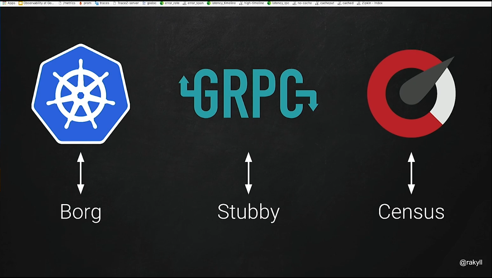

# Observability at Google

Source: https://learning.oreilly.com/videos/observability-at-google/0636920424239/0636920424239-video329911/

> A service is available if users can't tell there is an outage

## Introduction

A little of history: Google has a long history of distributed systems, with 10ks of different services, built by 100s of teams, so Google invented many analysis tools.

Achieving 100% availability is impossible, so how do we define a good enough availability? The answer is with SLOs, i.e., we can define what kind of downtime is acceptable. Common SLOs regarding downtime is:

- error rate
- latency expectations

## Tackling outages

> An observable system tells more than it's availability

To analyse the outage/problems, we need data, so we have to collect signals, export them to analysis tools, and **correlate** them to find the root cause of the problems. Common tools for monitoring/debugging:

- tracings
- cpu/mem profiling
- metrics
- logs
  
Given an outage happens, we can use the system's data to find out what happened, and how to fix it. 

## Difficulties for collecting system's data

It's hard to collect these data from the plethora of vendors, tools, languages for collecting these systems debugging/monitoring data.

Google developed an internal framework to help handle the problem, and open sourced a project called `opencensus`

Opencensus supports:

- metrics
- distributed traces
- profiles, available for golang only, as of the speak
- exporting to lots of vendors, like:
  - prometheus
  - stackdriver
  - datadog
  - and others, among custom exporter

## Lessons learned

- availability should enter the process of planing and development of an application, it's important to establish sensible SLOs 
- monitoring tools are invaluable to both detecting/handling outages, and to prevent them
- opencensus is an opensource tool, that may be usefull to correlate application metrics to investigate issues
