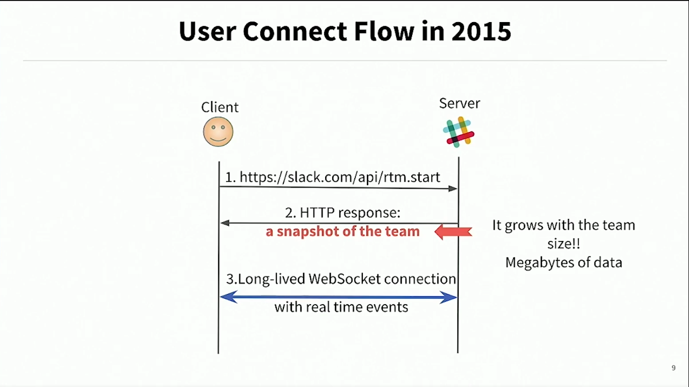
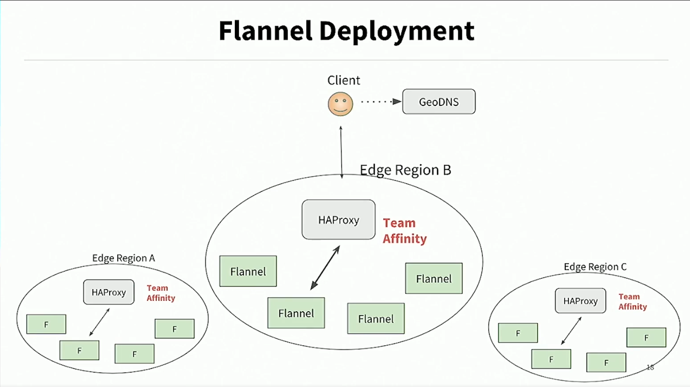
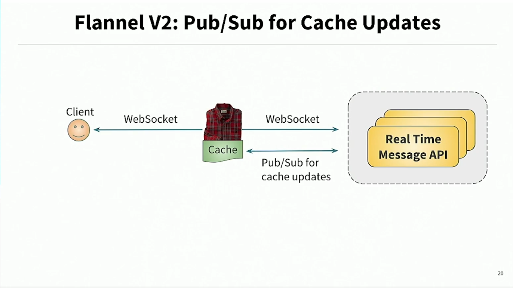
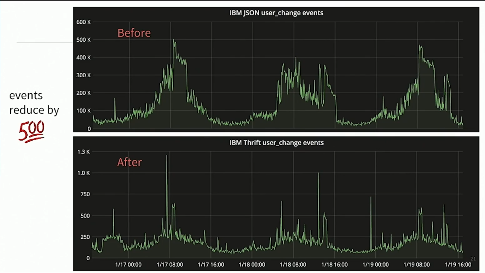
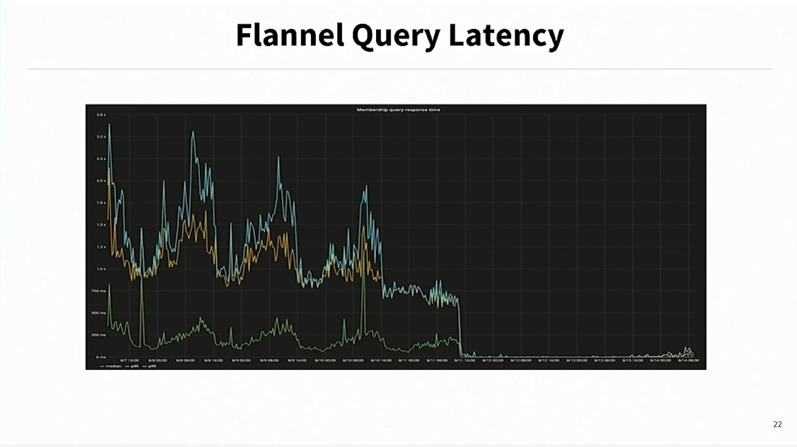
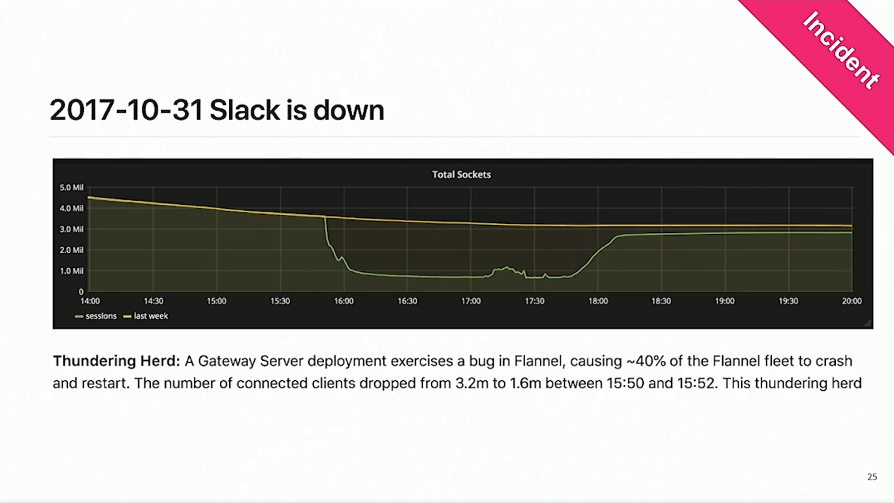

# How Slack rearchitected its system to achieve zero downtime and improve latency, reliability and availability

## Introduction

Slack user base grew by a lot, so some architectural design decisions were not optimal for the growing user base.

| year | users |
| :-: | :-: |
| 2015 | 8k |
| 2016 | 26k |
| 2017 | 266k |

The challenge was the initial connection of the client with the server. Check image below for the initial connection algorithm

Notice that the a snapshot of the user's channels, and conversations, is sent over the wire, and then a websocket is openned, this websocket updates the state of the client with new changes over the snapshot.

The problem is that the connection time grlatencyows with the amount of channels/team of the user. I.e., big teams, means bigger snapshots and bigger load times.

## How slack solved the problem

### Client Lazy Loading

The first step was to rewrite client's data model layer to load data asynchronously, so the server can fulfill requests with low latency.

### Flannel: an edge cache service

The second step was to build an intermediate for the requests between server and clients, that serves works as a cache service.

This service would cache the requests for a given team within a geographical region for the clients that connects to it.

The natural problem with caches is the cold start problem, i.e., the first user to connect to the server, will always find the cache clean, and will have to wait the cache to preheat.

Another problem with the initial flannel implementation was that some events (cache updates) were replicated to all the clients, and the server wasted processing time with these repeated updates.

The solution for this problem was implemented in flannel v2, which used a built in house pub/sub system, that both can pre-warm the cache, and untie the updates from a 2 way connection to the server, eliminating the repeated updates to the server.

After the improvements they achieved reduction in both RT and processed events, as can be seen in the images below

## Slack outage

In 2017 a bugged deployment caused flannel servers to crash, causing open client sockets to drop from 3.2M to 1.6M, which in turn caused the caches to be cold, and caused even more requests to the servers, overloading them.

### Lessons learned

> Failures are inevitable

Since it's true, how do we:

1. Avoid cascading failures
2. Minimize recovery time

Solutions:

1. Admission control: the server rejects more requests than it can handle
2. Circuit breaker: clients implement CB, i.e., stop requesting if the server is not responding, giving it a chance to recover
3. Auto Scaling: deploy more servers depending in the amount of requests
4. Regional Failover: if a server is offline, transfer requests to neighbor server
